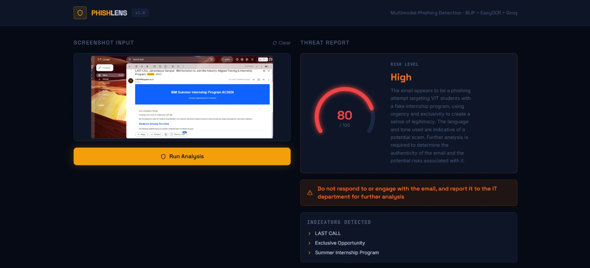
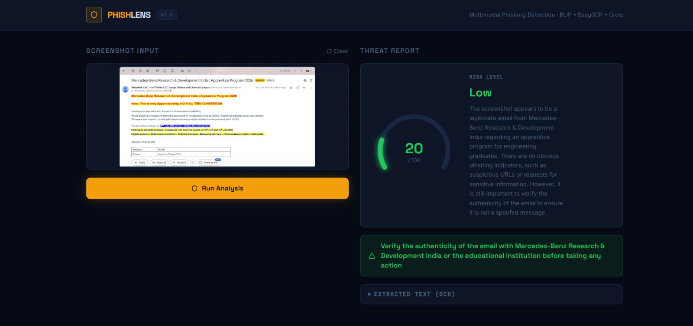

# PhishLens — Multimodal Phishing Screenshot Analyzer

Detects phishing in screenshots using a 4-stage AI pipeline:

| Stage | Model | Purpose |
|-------|-------|---------|
| 1 | BLIP (Salesforce) | Visual scene understanding |
| 2 | EasyOCR | Text extraction from image |
| 3 | VirusTotal API | URL reputation scanning |
| 4 | Groq / LLaMA-3.3-70B | Threat synthesis + risk scoring |

---

## Demo

### High Risk — Fake IBM Internship Phishing Email (Score: 80/100)



A Gmail screenshot flagged as **High risk** with a score of 80/100. The email impersonates an IBM Summer Internship Program targeting VIT students, using urgency language ("LAST CALL"), exclusivity cues ("Exclusive Opportunity for VIT Students"), and a suspicious sender domain. PhishLens correctly identified the social engineering tactics and recommended not engaging with the email and reporting it to the IT department.

---

### Low Risk — Legitimate Mercedes-Benz Apprenticeship Email (Score: 20/100)



A Gmail screenshot rated **Low risk** with a score of 20/100. The email is a legitimate communication from Mercedes-Benz Research & Development India via the VITIANS CDC Group regarding an Apprentice Program 2026. No suspicious URLs, no requests for sensitive information, and no urgency manipulation detected. PhishLens correctly cleared it while still advising to verify authenticity before taking action — appropriate caution for any unsolicited email.

---

## Setup

### 1. Clone & create `.env`
```bash
cp .env.example .env
# Fill in GROQ_API_KEY and VIRUSTOTAL_API_KEY
```
Get your keys:
- Groq: https://console.groq.com
- VirusTotal: https://www.virustotal.com/gui/my-apikey (free tier)

### 2. Backend
```bash
python -m venv venv
venv\Scripts\activate
pip install -r requirements.txt
python app.py
```

### 3. Frontend (separate terminal)
```bash
cd frontend
npm install
npm run dev
```

Open http://localhost:5173

---

## How It Works

1. Upload a suspicious email or webpage screenshot
2. **BLIP** generates a visual description of the layout, logos, and visual cues
3. **EasyOCR** extracts all visible text including URLs, sender info, and CTAs
4. Extracted URLs are submitted to **VirusTotal** for reputation checking
5. All signals are fed to **LLaMA-3.3-70B via Groq** for a structured threat report:
   - Risk score (0–100)
   - Risk level (Low / Medium / High / Critical)
   - Specific phishing indicators detected
   - Recommended action

---

## Tech Stack

**Backend:** Python · Flask · BLIP · EasyOCR · Groq API · VirusTotal API  
**Frontend:** React · Vite · Tailwind CSS

---

## Evaluation

To benchmark against real phishing data:
1. Download samples from [PhishTank](https://phishtank.org/developer_info.php) (free CSV)
2. Take screenshots of flagged URLs
3. Run through the `/analyze` endpoint
4. Log `risk_score` and `risk_level` against known labels
5. Compute precision / recall

